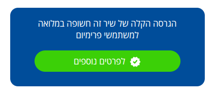
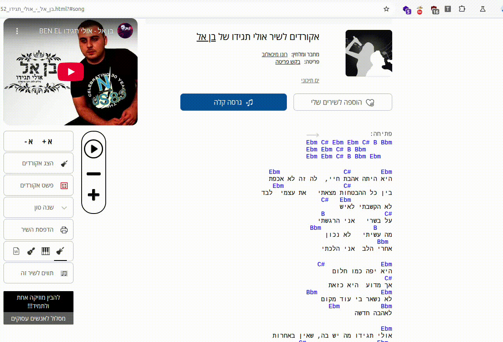

# DEPRECATED - CHECK OUT [Tab3U-NG](https://github.com/eyalasulin999/Tab3U-NG) OR https://tab3u.com

## Tab3U

### https://chromewebstore.google.com/detail/jnbkjlemlomecmccnppbknlnkelhfllh

You may have browsed [Tab4U](https://www.tab4u.com) chords website, tried clicking that button

and got

FUCK

So I developed Tab3U - Tab(Free)U

Chrome extension that allows free transposition tool for Tab4U

### Demo

### TBD
- Add status & controller to chords page (currently on extension's popup)
- Add capo position
- Tabs transpose
- Chords view fix
